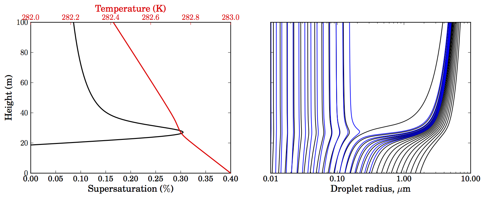

# Summary

This fork of pyrcel updates the package so that it can represent parcels that start un-saturated. The primary change is an updated calculation for the time derivative of the supersaturation. The expression used in the base version, taken from Ghan et al. (2011), makes several simplifying assumptions, including $RH \approx 1$, which means it cannot accurately simulate air parcels that start with RH substantially less than 1, and will predict a lower than expected lifting condensation level. This fork also updates the latent heat of vaporization for water to a value appropriate for $T=0^{\circ}C$, and makes small changes to how some of the variables used internally in the ODE system are calculated. 


# Updated $\frac{dS}{dt}$ formula
 This change updates the expression for $\frac{dS}{dt}$ to:
$$\frac{dS}{dt} = \alpha V + \gamma\frac{dw_v}{dt}$$
$$\alpha = \frac{RHg}{R_vT}\left(\frac{L_v}{C_pT}-\left(\frac{1+w_v}{\varepsilon + w_v}\right)\right)$$
$$\gamma = \frac{RHL_v^2}{C_pR_vT^2} + \left(\frac{P\varepsilon}{e_s(\varepsilon+w_v)^2}\right)$$
which is accurate even when $RH \neq 1$.


# Other changes
These changes have also been made to the ODE system function (``parcel_ode_sys()`` in ``_parcel_aux_numba.py``) and the constants file (``constants.py``). 
- The latent heat of vaporization for water has been updated from $L_v = 2.25 \times 10^{-6} \frac{J}{kgK}$, which is appropriate for $T=100^{\circ}C$, to $L_v = 2.5\times 10^{-6} \frac{J}{kgK}$, which is appropriate for $T=0^{\circ}C$.
- The molecular weight of water and dry air and the universal gas constant are now defined with higher precision. $\varepsilon$ is now calculated as $\frac{M_w}{M_a}$. Previously $\varepsilon$ was defined to be 0.622 but $M_w$ and $M_a$ were not given precisely enough so that $\frac{M_w}{M_a} = 0.622$.
- The calculation for the virtual temperature has been changed from $T_v = T(1 + 0.61w_v)$ to $T_v = T\left(\frac{1+w_v/\varepsilon}{1+w_v}\right)$
- Previously, the ODE system calculated $e_s$ using the Magnus formula, but the formula for $\frac{dS}{dt}$ invokes the Clausius-Clapeyron relation for $\frac{de_s}{dt} = \frac{de_s}{dT}\frac{dT}{dt}$, which is a slight inconsistency. This fork calculates $e$ as $\frac{Pw_v}{\varepsilon + w_v}$ and then calculates $e_s$ as $\frac{e}{S+1}$ and avoids using the Magnus formula.

# Impact
The parcel model can now represent air parcels that start unsaturated. The change to the formula for $\frac{dS}{dt}$ should have minimal impact on simulations of saturated parcels because it is nearly the same as the Ghan et al. (2011) formula in these scenarios. For saturated parcels, the higher value of $L_v$ will make a larger difference.

I still need to run more exhaustive tests of this fork. So far I have found that for <a href='https://pyrcel.readthedocs.io/en/latest/examples/activate.html'>these sample cases</a> given in the pyrcel documentation, the update to $L_v$ leads to marginally higher activation fractions and maximum supersaturations. The new formula for $\frac{dS}{dt}$ predicts correct LCLs for parcels that start unsaturated compared to the metpy package and a skew-T chart. I still need to run more diverse tests of aerosol activation however, to ensure the new formulas don't increase run-time or cause the integration to fail.

# $\frac{dS}{dt}$ derivation
This is a derivation for the updated $\frac{dS}{dt}$ formula:
$$\frac{dS}{dt} = \frac{dRH}{dt} = \frac{d}{dt} \left(\frac{e}{e_s}\right)$$
$$\frac{dRH}{dt} = e_s^{-2} \left(\frac{de}{dt}e_s - \frac{de_s}{dt}e\right)$$
Using Clausius-Clapeyron:
$$\frac{de_s}{dt} = \frac{de_s}{dT} \frac{dT}{dt}$$
$$\frac{de_s}{dT} = \frac{L_ve_s}{R_vT^2}$$
$$\frac{de_s}{dt} = e_s\frac{dT}{dt}\frac{L_v}{R_vT^2}$$
For the vapor pressure derivative:
$$e = \frac{Pw_v}{\varepsilon + w_v}$$
$$\frac{de}{dt} = \frac{d}{dt} \left(\frac{Pw_v}{\varepsilon + w_v}\right)$$
$$\frac{de}{dt} = \frac{1}{(\varepsilon+w_v)^2}\left(\frac{d}{dt}(Pw_v)(\varepsilon+w_v) - \frac{d}{dt}(\varepsilon+w_v)(Pw_v)\right)$$
$$\frac{de}{dt} = \left(P\frac{dw_v}{dt} + w_v\frac{dP}{dt}\right)\frac{1}{\varepsilon+w_v} - \frac{dw_v}{dt}\frac{Pw_v}{(\varepsilon+w_v)^2}$$
$$\frac{de}{dt} = \frac{e}{w_v}\frac{dw_v}{dt} + \frac{e}{P}\frac{dP}{dt} - e\frac{dw_v}{dt}\frac{1}{\varepsilon + w_v}$$
$$\frac{de}{dt} = \frac{e}{P}\frac{dP}{dt} + e\frac{dw_v}{dt}\left(\frac{1}{w_v} - \frac{1}{\varepsilon + w_v}\right)$$
Finally:
$$\frac{dRH}{dt} = e_s^{-2} \left(\left(\frac{e}{P}\frac{dP}{dt} + e\frac{dw_v}{dt}\left(\frac{1}{w_v} - \frac{1}{\varepsilon + w_v}\right)\right)e_s - \left(e_s\frac{dT}{dt}\frac{L_v}{R_vT^2}\right)e\right)$$
$$\frac{dRH}{dt} = RH \left(\frac{1}{P}\frac{dP}{dt}- \frac{dT}{dt}\frac{L_v}{R_vT^2} + \frac{dw_v}{dt}\left(\frac{1}{w_v} - \frac{1}{\varepsilon + w_v}\right)\right)$$
When $RH \approx 0$ the $1/w_v$ term could be very large. This can be removed by distributing the $RH$ term:
$$\frac{dRH}{dt} = RH \left(\frac{1}{P}\frac{dP}{dt}- \frac{dT}{dt}\frac{L_v}{R_vT^2}\right) + \frac{dw_v}{dt}\left(\frac{P\varepsilon}{e_s(\varepsilon+w_v)^2}\right)$$
This can be used for the $S$ derivative in pyrcel because it directly uses the other time derivatives already computed by the parcel model. We can also eliminate the derivatives of $P$ and $T$ and separate out the components due to adiabatic ascent and due to condensation like the formula used in Ghan et al. (2011):
$$\frac{dP}{dt} = -g\rho V$$
where $\rho = \frac{P}{R_dT_v}$ and $T_v = T\frac{1+\frac{w_v}{\varepsilon}}{1+w_v}$
$$\frac{1}{P}\frac{dP}{dt} = -\frac{1}{P}g\left( \frac{P}{R_d\left(T\frac{1+\frac{w_v}{\varepsilon}}{1+w_v}\right)}\right)V$$
$$\frac{1}{P}\frac{dP}{dt} = -\frac{gV\varepsilon(1+w_v)}{R_dT(\varepsilon + w_v)}$$
$$\frac{1}{P}\frac{dP}{dt} = -\frac{gVM_w(1+w_v)}{RT(\varepsilon + w_v)}$$
For the temperature derivative:
$$\frac{dT}{dt}\frac{L_v}{R_vT^2} = -\left(\frac{gV}{C_p} + \frac{L_v}{C_p}\frac{dw_v}{dt}\right)\frac{L_v}{R_vT^2}$$
$$\frac{dT}{dt}\frac{L_v}{R_vT^2} = -V\frac{gL_v}{C_pR_vT^2} - \frac{dw_v}{dt}\frac{L_v^2}{C_pR_vT^2}$$
$$\frac{dT}{dt}\frac{L_v}{R_vT^2} = -V\frac{gL_vM_w}{C_pRT^2} - \frac{dw_v}{dt}\frac{L_v^2M_w}{C_pRT^2}$$
Plugging these into the expression for the RH derivative:
$$\frac{1}{RH}\frac{dRH}{dt} = -V\frac{g}{R_vT}\left(\frac{1+w_v}{\varepsilon + w_v}\right) + V\frac{gL_v}{C_pR_vT^2} + \frac{dw_v}{dt}\frac{L_v^2}{C_pR_vT^2} + \frac{dw_v}{dt}\frac{\varepsilon}{w_v(\varepsilon + w_v)}$$
The change due to adiabatic ascent and the change due to condensation are now separable:
$$\frac{dS}{dt} = \alpha V + \gamma\frac{dw_v}{dt}$$
$$\alpha = \frac{RHg}{R_vT}\left(\frac{L_v}{C_pT}-\frac{1+w_v}{\varepsilon + w_v}\right)$$
$$\gamma = \frac{RHL_v^2}{C_pR_vT^2} + \frac{P\varepsilon}{e_s(\varepsilon+w_v)^2}$$
These are slightly different than the formulas given in Ghan et al. 2011. If we make the assumptions that $RH \approx 1$, $(1+w_v) \approx 1$, and $(\varepsilon + w_v) \approx \varepsilon$, then this simplifies to the formula from Ghan et al. 2011 (originally from  Pruppacher and Klett). These assumptions will not work for parcels that do not start saturated though.

-Andrew Geiss, PNNL, April 9th, 2025.


pyrcel: cloud parcel model
==========================



[](https://zenodo.org/badge/latestdoi/12927551)[](https://badge.fury.io/py/pyrcel)[](https://circleci.com/gh/darothen/pyrcel/tree/master)[](http://pyrcel.readthedocs.io/en/latest/index.html)


This is an implementation of a simple, adiabatic cloud parcel model for use in
aerosol-cloud interaction studies. [Rothenberg and Wang (2016)](http://journals.ametsoc.org/doi/full/10.1175/JAS-D-15-0223.1) discuss the model in detail and its improvements
 and changes over [Nenes et al (2001)][nenes2001]:

* Implementation of κ-Köhler theory for condensation physics ([Petters and
Kreidenweis, 2007)][pk2007]
* Extension of model to handle arbitrary sectional representations of aerosol
populations, based on user-controlled empirical or parameterized size distributions
* Improved, modular numerical framework for integrating the model, including bindings
to several different stiff integrators:
    - ~~`lsoda` - [scipy ODEINT wrapper](http://docs.scipy.org/doc/scipy/reference/generated/scipy.integrate.odeint.html)~~
    - ~~`vode, lsode*, lsoda*` - ODEPACK via [odespy][hplgit]~~
    - `cvode` - SUNDIALS via [Assimulo](http://www.jmodelica.org/assimulo_home/index.html#)

among other details. It also includes a library of droplet activation routines and scripts/notebooks for evaluating those schemes against equivalent calculations done with the parcel model.

> [!WARNING]
> As of version 1.3, we no longer support any ODE solver backends other than `cvode`.
> All publications using this model have used this backend, so users shouldn't expect
> any inconsistencies with historical results. A future version is planned to add a new
> suite of ODE solvers from the [diffrax][diffrax] toolkit.

Updated code can be found the project [github repository](https://github.com/darothen/pyrcel). If you'd like to use this code or have any questions about it, please [contact the author][author_email]. In particular, if you use this code for research purposes, be sure to carefully read through the model and ensure that you have tweaked/configured it for your purposes (i.e., modifying the accomodation coefficient); other derived quantities).

[Detailed documentation is available](http://pyrcel.readthedocs.org/en/latest/index.html), including a [scientific description](http://pyrcel.readthedocs.org/en/latest/sci_descr.html), [installation details](http://pyrcel.readthedocs.org/en/latest/install.html), and a [basic example](http://pyrcel.readthedocs.org/en/latest/examples/basic_run.html) which produces a figure like the plot at the top of this page.

Quick Start
-----------

As of February, 2025, we provide an ultra simple way to run `pyrcel` without any installation
or setup using [`pixi`](https://pixi.sh/latest/).
`pixi` is an all-in-one package management tool that makes handling complex environment
setup and dependencies extremely easy.

Clone or download this repo, then **cd** into the top-level folder from a terminal.
From there, execute:

``` shell
$ pixi run run_parcel examples/simple.yml
```

This will automatically prepare an environment with all of `pyrcel`'s dependencies installed,
and then run an example model setup.
The first time the model runs, it may take a few second after invoking the script; this is
normal, and is just a side-effect of `numba` caching and pre-compiling some of the functions
used to drive the parcel model simulation.

> [!NOTE]
> We provide `pixi` environments for Linux, MacOS (both Intel and Apple Silicon) and
> Windows, but we have never tried to run the model on a Windows computer so your mileage
> may vary. Contact the authors if you have any questions and we can try to support your
> use case.

Installation
------------

To get started with using `pyrcel`, complete the following steps:

1. Set up a new Python environment; we recommend using [mambaforge](https://conda-forge.org/miniforge/):
  
``` shell
  $ mamba create -n pyrcel_quick_start python=3.11
```

2. Activate the new Python environment and install the model and its dependencies. If you install the published version from PyPi (_recommended_), then you also need to install [Assimulo](http://www.jmodelica.org/assimulo) using the Mamba package manager - but no other manual dependency installation is necessary:
  
``` shell
  $ mamba activate pyrcel_quick_start
  $ pip install pyrcel
  $ mamba install -c conda-forge assimulo
```

3. Run a test simulation using the CLI tool and a sample YAML file from **pyrcel/examples/\*.yml** (you may want to clone the repository or download them locally):
  
``` shell
  $ run_parcel simple.yml
```

* Visualize the output NetCDF (should be in the directory you ran the CLI tool, at **output/simple.nc**)

That's it! You should be able to import `pyrcel` into any script or program running in the
environment you created.


Requirements
------------

**Required**

* Python >= 3.8
* [numba](http://numba.pydata.org)
* [NumPy](http://www.numpy.org)
* [SciPy](http://www.scipy.org)
* [pandas](http://pandas.pydata.org)
* [xarray](http://xarray.pydata.org/en/stable/)
* [PyYAML](http://pyyaml.org/)

Additionally, the following packages are used for better numerics (ODE solving)

* [Assimulo](http://www.jmodelica.org/assimulo)

The easiest way to satisfy the basic requirements for building and running the
model is to use the [Anaconda](http://continuum.io/downloads) scientific Python
distribution. Alternatively, a
[miniconda environment](http://conda.pydata.org/docs/using/envs.html) is
provided to quickly set-up and get running the model. Assimulo's dependency on
the SUNDIALS library makes it a little bit tougher to install in an automated
fashion, so it has not been included in the automatic setup provided here; you
should refer to [Assimulo's documentation](http://www.jmodelica.org/assimulo_home/installation.html)
for more information on its installation process. Note that many components of
the model and package can be used without Assimulo.

Development
-----------

[http://github.com/darothen/pyrcel]()

Please fork this repository if you intend to develop the model further so that the
code's provenance can be maintained.

License / Usage
---------------

[All scientific code should be licensed](http://www.astrobetter.com/the-whys-and-hows-of-licensing-scientific-code/). This code is released under the New BSD (3-clause) [license](LICENSE.md).

You are free to use this code however you would like.
If you use this for any scientific work resulting in a publication or citation, please
cite our original publication detailing the model, and let the authors know:

```
@article { 
      author = "Daniel Rothenberg and Chien Wang",
      title = "Metamodeling of Droplet Activation for Global Climate Models",
      journal = "Journal of the Atmospheric Sciences",
      year = "2016",
      publisher = "American Meteorological Society",
      address = "Boston MA, USA",
      volume = "73",
      number = "3",
      doi = "10.1175/JAS-D-15-0223.1",
      pages= "1255 - 1272",
      url = "https://journals.ametsoc.org/view/journals/atsc/73/3/jas-d-15-0223.1.xml"
}
```


[author_email]: mailto:daniel@danielrothenberg.com
[nenes2001]: http://nenes.eas.gatech.edu/Preprints/KinLimitations_TellusPP.pdf
[pk2007]: http://www.atmos-chem-phys.net/7/1961/2007/acp-7-1961-2007.html
[hplgit]: https://github.com/hplgit/odespy
[diffrax]: https://docs.kidger.site/diffrax/
